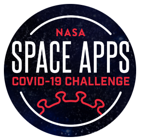
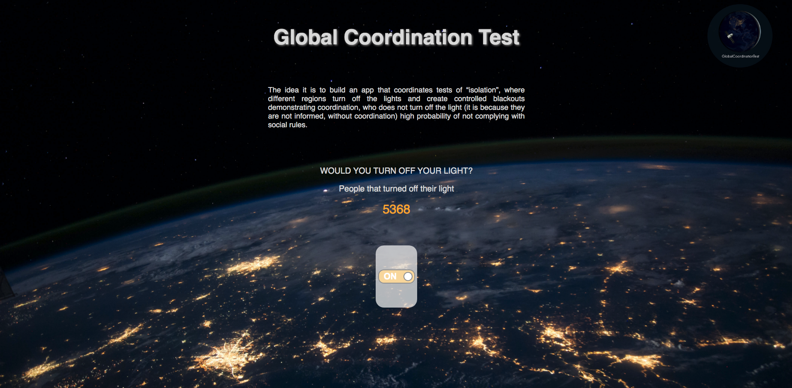

<h1 align="center">Global Coordination Test</h1>

<a href="https://covid19.spaceappschallenge.org/challenges/covid-challenges/light-path/teams/global-coordination-test/project">

 
<h3> How it Works </h3>
<h6 align="justify"> The idea is to build an app that coordinates tests of “isolation”, where different regions turn off their lights and 
create controlled blackouts demonstrating coordination, who does not turn off the light (it is because they are 
not informed, without coordination) high probability of not complying with social rules.</h6>
<h3>Sample</h3>

> Work in Progress
>
> - Built an primary interface with the main idea.

<strong>Link to the project:</strong> [Here](https://covid19.spaceappschallenge.org/challenges/covid-challenges/light-path/teams/global-coordination-test/project)